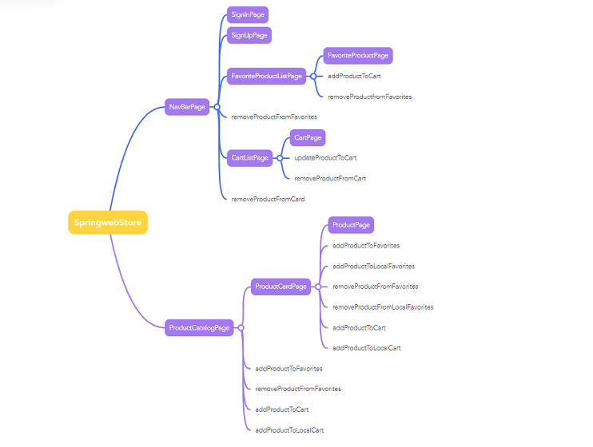
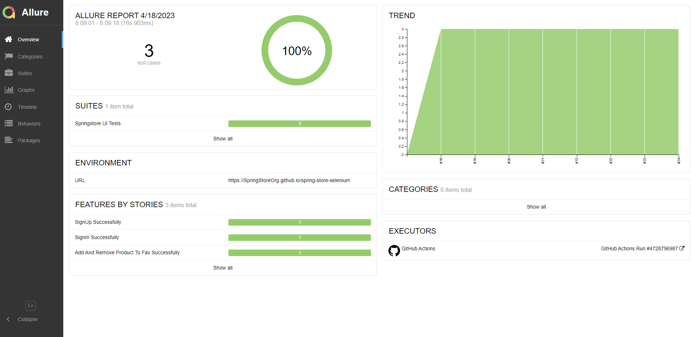

   

# SpringStore Selenium Project  

This is a Java / Maven / Selenium Test automation project built on Page Factory design.

The project "spring-store-selenium" is a test automation project dedicated to test the functionalities of the website "Spring Store" (url: https://www.springwebstore.com/)

Project features:

This project is built on Selenium with Page Factory design pattern and makes use of maven as the build tool
All the test cases, test data, page objects, configurations and utilities are within the package src/test/java
At the moment test can be run on Chrome browser only, in future we can add support for other browsers as well.

## Test Map of the application

## How to Run
in config.properties file, set the following properties: headlessMode = false (default value is true)
In order to run all the test cases we can execute by using "mvn clean test" command in the terminal

## How to Run a single test case
In order to run a single test case we can execute by using "mvn clean test -Dtest=TestClassName#testMethodName" command in the terminal

## Test Results
in order to generate locally the
[Allure Test Results](https://springstoreorg.github.io/spring-store-selenium/)
, following command has to be run in the terminal: "allure serve {path to project}\target\allure-results"

